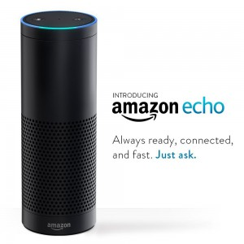

###Here's a simple guide on how to create a Node.js app hosted in Azure that will handle your Amazon Echo's API calls.

<a href="http://amzn.to/1Lo5eho">
    

      
       
      Amazon Echo Application Testing
    

</a>

